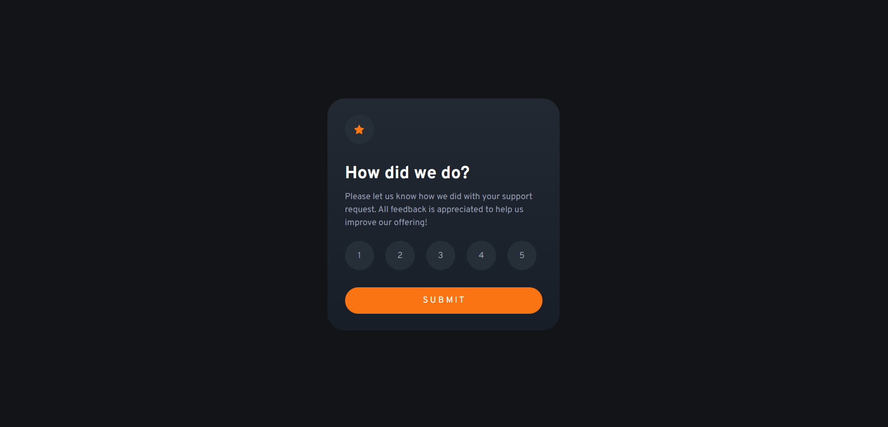
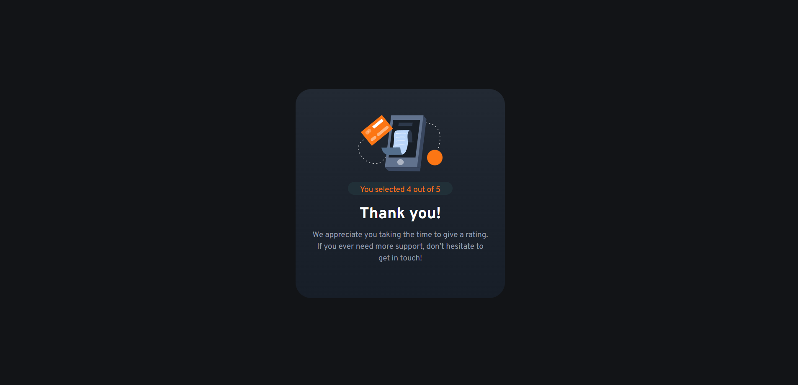

# Frontend Mentor - Interactive rating component

This is a solution to the interactive rating component challenge on Frontend Mentor

### Screenshot

### Links

- Live Site URL: (https://exquisite-choux-471bf0.netlify.app/)

### Built with

- Semantic HTML5 markup
- CSS
- Javascript